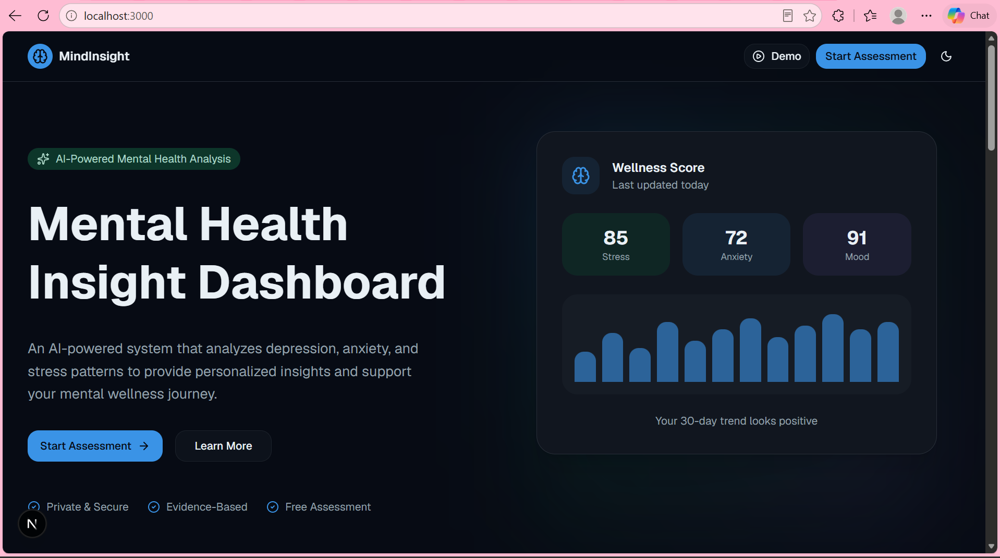
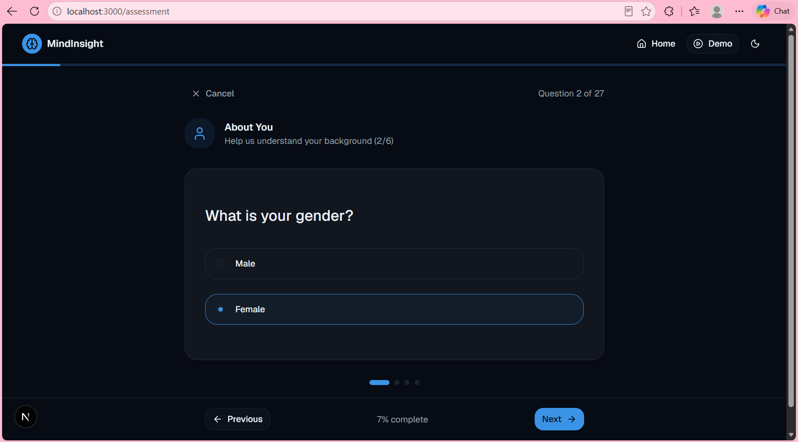
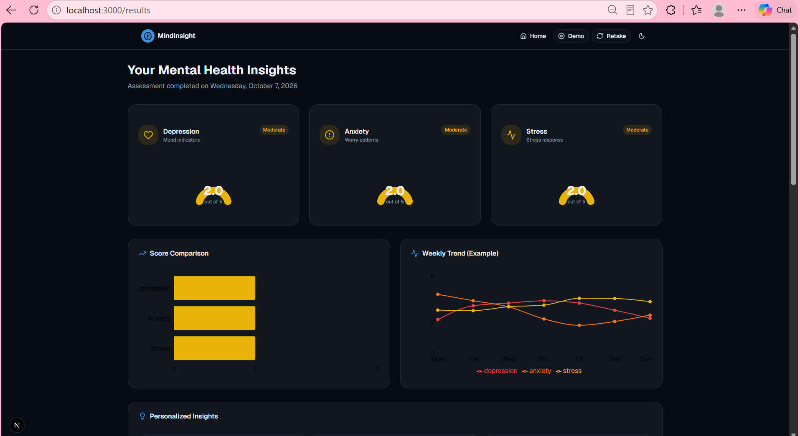
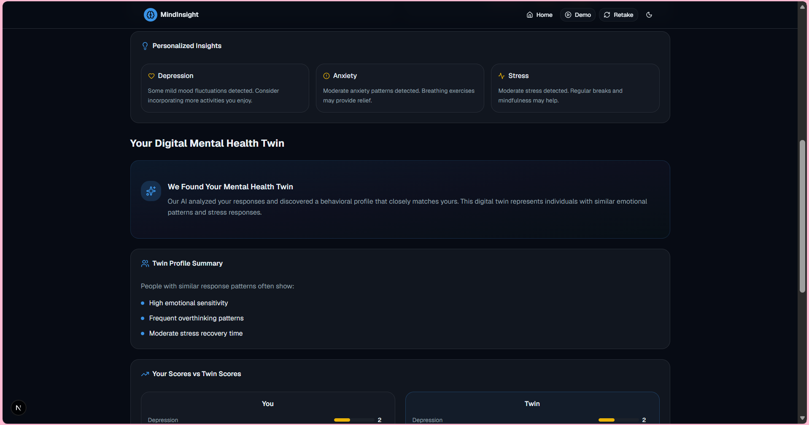
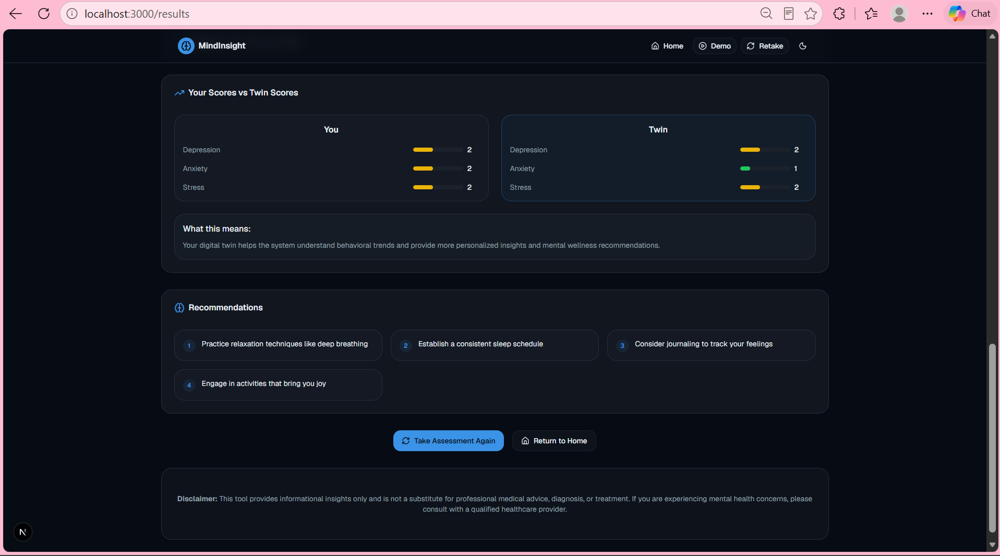

# MindInsight 🧠

MindInsight is an AI-powered mental wellness screening system that uses a multi-output Artificial Neural Network (ANN) to predict Depression, Anxiety and Stress levels from Depression Anxiety Stress Scale (DASS) questionnaire responses.

## Features
- Depression, Anxiety and Stress prediction
- Multi-output ANN model
- Personalized recommendations
- Weekly trend analysis
- Digital Mental Health Twin
- Interactive dashboard
- Flask backend with a Next.js frontend

## Tech Stack
- **Backend:** Python, Flask
- **Machine Learning:** TensorFlow, Keras, Scikit-learn, Pandas, NumPy
- **Frontend:** Next.js, React, TypeScript
- **Dataset:** DASS questionnaire data

## How It Works
1. The user answers 27 questionnaire questions.
2. Responses are processed and scaled.
3. The ANN model predicts Depression, Anxiety and Stress levels together.
4. Results are shown with visual insights and recommendations.

##Screenshots

### Home

*The landing page, where users [start a session / choose an option / enter their details].*

### Asking a Question

*The input screen, where the user types or selects [their question / the prompt they want analysed].*

### Results

*Result 1: [what this output shows, e.g. the answer or summary generated for the question].*


*Result 2: [e.g. a detailed breakdown, chart, or follow-up insight].*


*Result 3: [e.g. recommendations, a score, or a different example input and its output].*


## How to Run

**Backend**
```bash
python -m venv venv
source venv/Scripts/activate
pip install -r requirements.txt
python app.py
```

**Frontend** (in a second terminal)
```bash
cd frontend
npm install
npm run dev
```

Open http://localhost:3000 in your browser.

## Project Structure
- `app.py` – Flask API
- `Train_model.py` – model training
- `Predict.py` – prediction logic
- `prepare_data.py` – data preprocessing
- `models/` – trained model and scaler
- `DASS.csv` – dataset
- `frontend/` – Next.js web interface

## Team
- Navya Nanda
- Sakshi Arora

## Disclaimer
MindInsight is an awareness and screening tool. It is not intended to diagnose, treat, or replace professional medical advice. Users with severe results are encouraged to consult a healthcare professional.
